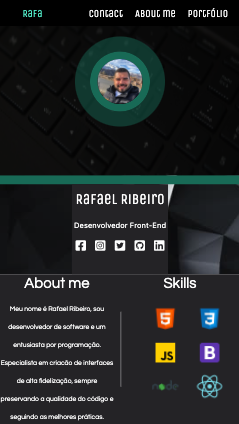

# My Psersonal site
 

 
 
 

# MOBILE VERSION
 
 

         

 

# TECHNOLOGIES

* HTML
* CSS
* JAVASCRIPT

## Thanks for viewing my project.

Don't forget to follow me on Linkedin https://www.linkedin.com/in/rafael1807/

